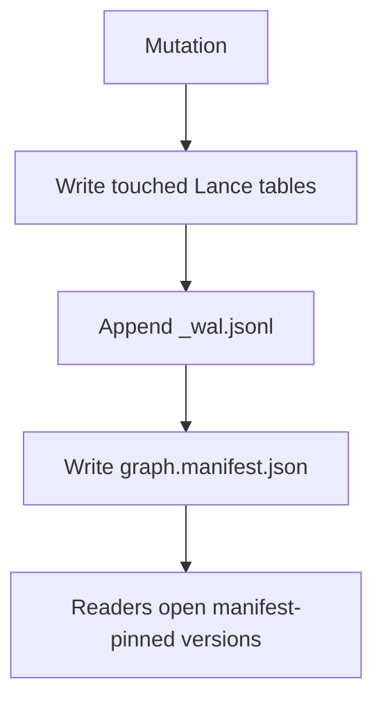
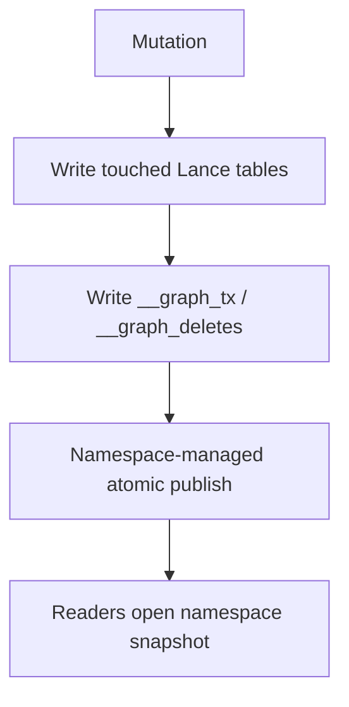

# Commit Flow Sketch

This note sketches the current nanograph commit path and the target Lance v4 namespace-managed path.

## Current v3 Flow

Authority today:
- table state lives in Lance datasets
- logical history lives in `_wal.jsonl`
- graph visibility lives in `graph.manifest.json`

Write flow:
1. Build one graph mutation delta.
2. Write touched node and edge Lance tables independently.
3. Append logical commit and CDC rows to `_wal.jsonl`.
4. Write `graph.manifest.json` with:
   - next `db_version`
   - pinned dataset versions
   - commit timestamp
5. Readers trust only manifest-pinned versions.

Properties:
- graph-wide atomicity comes from the manifest, not from Lance itself
- CDC comes from the WAL, not from table lineage
- partial table writes are tolerated because they stay invisible until the manifest advances

## Target v4 Namespace Flow

Authority later:
- table state lives in Lance tables
- graph visibility lives in Lance namespace `__manifest`
- graph transaction metadata lives in `__graph_tx`
- deletes live in `__graph_deletes`
- inserts/updates are reconstructed from lineage

Write flow:
1. Build one graph mutation delta.
2. Write touched node and edge tables with transaction properties:
   - `graph_version`
   - `tx_id`
   - summary metadata
3. Write coordinator side tables such as `__graph_tx` and `__graph_deletes`.
4. Atomically publish all touched table versions through the namespace manifest.
5. Readers open the namespace-pinned snapshot.

Properties:
- graph-wide atomicity comes from Lance namespace publish
- no separate `graph.manifest.json`
- no `_wal.jsonl`
- CDC becomes:
  - inserts from `_row_created_at_version`
  - updates from `_row_last_updated_at_version`
  - deletes from `__graph_deletes`

## Main Difference

Current nanograph:
- Lance stores data
- nanograph owns graph commit visibility

Target v4 nanograph:
- Lance stores data
- Lance namespace owns graph snapshot visibility
- nanograph keeps only thin graph semantics tables

## Why Namespace Matters

MemWAL helps one table read and write efficiently.

Namespace helps many tables become visible together.

For nanograph, the hard requirement is not just fast table writes. It is:

> `Person`, `Company`, and `WorksAt` must commit as one graph snapshot.

That is why namespace-managed publish is the key architectural shift.

## Migration Shape

Practical migration path:
1. Upgrade runtime to Lance v4.
2. Start using v4 features that are table-local:
   - stable row IDs
   - blob v2
3. Add a storage migrator for existing v3 databases.
4. Introduce namespace-backed snapshots.
5. Retire `graph.manifest.json` and `_wal.jsonl`.

## Open Questions

- Which Lance namespace API shape should nanograph target first for local DBs: direct directory namespace or a thin nanograph wrapper over it?
- Should `__graph_tx` remain explicit even after namespace publish exists? Probably yes.
- Should `nanograph changes` preserve any part of the old row ordering contract, or only guarantee `graph_version` order?
