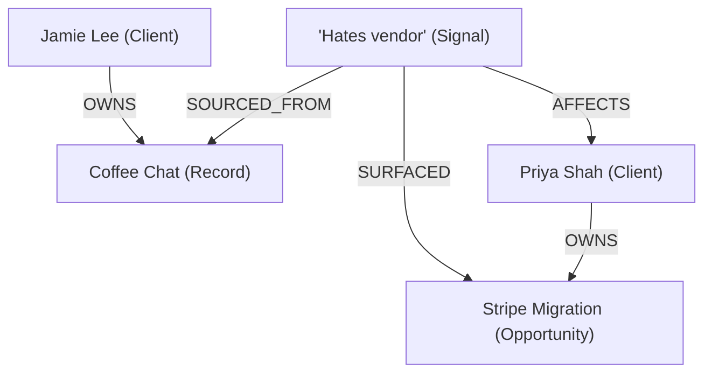
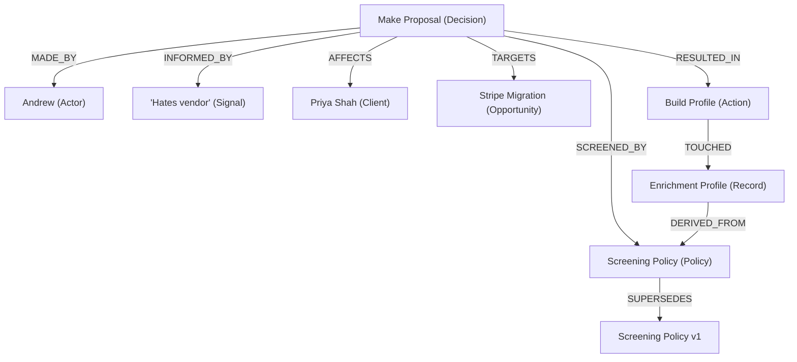
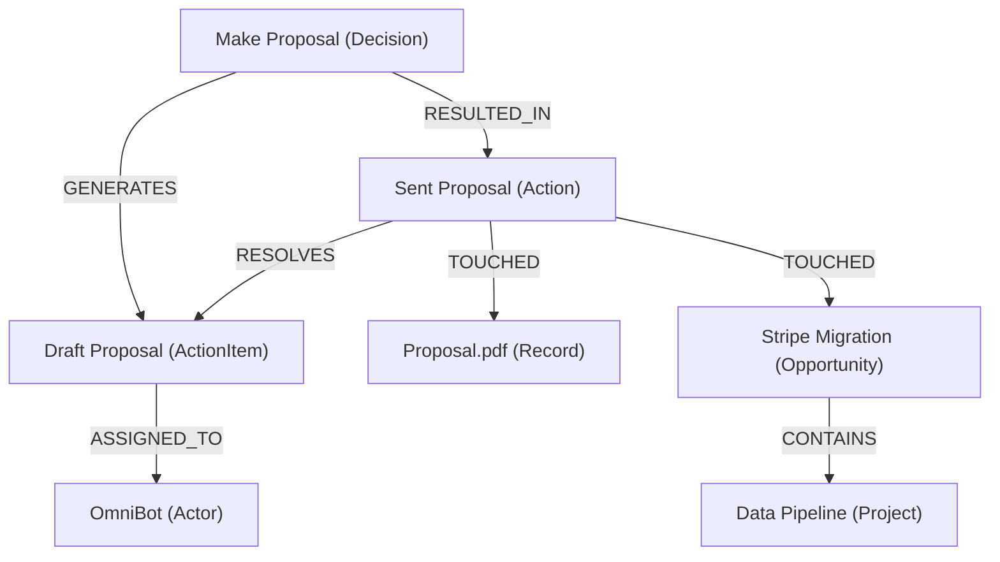

# Context Graph Example

A CRM / RevOps context graph that captures the full physics of execution — from intelligence capture through enrichment, screening, decision-making, and delivery. This example demonstrates NanoGraph's ability to model complex real-world workflows with typed nodes, edges, and decision traces.

The working implementation lives in `examples/revops/` in the repo.

## The trace

The graph captures a three-phase execution cycle. Each phase builds on the previous.

### Phase 1 — Intelligence: Signal surfaces an Opportunity

Jamie's coffee chat produces a Signal. The Signal links to who it's about and what deal it reveals.



### Phase 2 — Enrichment & Screening: Agent builds the case

The agent reads the Screening Policy, generates an Enrichment Profile based on its criteria, then the Decision is screened and passes.



### Phase 3 — Execution: Work is assigned, completed, and proven

The Decision generates work. The agent executes it, creating the proposal and advancing the deal.



## Schema overview

The schema has 10 node types in two classes and 21 edge types.

### Node types

| Class | Node types | Mutability |
|-------|-----------|------------|
| **Pointer** (mutable) | Client, Actor, Record, Opportunity, Project, ActionItem | Updated in place. Carry `slug @key`, `createdAt`, `updatedAt`, `notes`. |
| **Claims & Events** (append-only) | Decision, Signal, Policy, Action | Never overwritten. Corrections use `Supersedes`. Carry `slug @key`, `createdAt`. |

### Edge types (21)

| Category | Edges |
|----------|-------|
| **Decision Spine** | MadeBy, DecisionAffects, SignalAffects, InformedBy, ScreenedBy, ResultedIn, TouchedRecord, TouchedOpportunity, SourcedFrom |
| **Value Loop** | Surfaced, Targets, DecisionGenerates, AssignedTo, Resolves |
| **Versioning & Structure** | BasedOnPrecedent, Supersedes, ClientOwnsRecord, ClientOwnsOpportunity, ClientOwnsProject, Contains, DerivedFrom |

Full schema: [`examples/revops/revops.pg`](../../examples/revops/revops.pg)

## Design principles

- **Pointer vs Claims-and-Events**: Pointer nodes (Client, Opportunity, etc.) are updated in place — identity is stable. Claims & Events (Decision, Signal, Policy, Action) are append-only — history is never rewritten. Corrections append new nodes linked by `Supersedes`.
- **Bi-temporal timestamps**: Every Claims & Events node has two time dimensions — `createdAt` (when written to the graph) and a domain event field (`decidedAt`, `observedAt`, `executedAt`, `effectiveFrom`) for when it actually happened.
- **Slug identity**: Every node gets a hash-generated `slug` as its `@key` primary identifier, globally unique across the graph.
- **Policy versioning**: New policies `SUPERSEDES` old ones sharing the same `policyKey`. Past decisions screened against old versions retain their links.
- **Execution is proven by Actions**: A Decision is "executed" when it has at least one `ResultedIn → Action(success=true)`. No `executed` status — execution is proven by the Action log.
- **Enums over floats**: Continuous ranges replaced with semantic 3–4 value enums (`low`, `medium`, `high`, `critical`) for predictable graph queries.

## Setup

```bash
# Initialize
nanograph init omni.nano --schema examples/revops/revops.pg

# Load seed data (16 nodes, 22 edges — the Stripe Migration trace)
nanograph load omni.nano --data examples/revops/revops.jsonl --mode overwrite

# Typecheck queries
nanograph check --db omni.nano --query examples/revops/revops.gq
```

## Query walkthrough

### All clients

```bash
nanograph run --db omni.nano --query examples/revops/revops.gq --name all_clients
```

```
+----------------+------------+---------+---------+-------------+
| slug           | name       | status  | company | tags        |
+----------------+------------+---------+---------+-------------+
| cli-jamie-lee  | Jamie Lee  | healthy |         | [connector] |
| cli-priya-shah | Priya Shah | focus   | Stripe  | [client]    |
+----------------+------------+---------+---------+-------------+
```

### Decision trace — "Why did this happen?"

From an opportunity, trace who decided and what signal drove it:

```graphql
query decision_trace($opp: String) {
    match {
        $o: Opportunity { slug: $opp }
        $d targets $o
        $d madeBy $a
        $d informedBy $s
    }
    return { $o.title, $d.intent, $a.name, $s.summary, $s.urgency }
}
```

```bash
nanograph run --db omni.nano --query examples/revops/revops.gq \
  --name decision_trace --param opp=opp-stripe-migration
```

```
+------------------+------------------------------------+--------+------------------------------------------+---------+
| title            | intent                             | name   | summary                                  | urgency |
+------------------+------------------------------------+--------+------------------------------------------+---------+
| Stripe Migration | Make proposal for Stripe migration | Andrew | Priya hates her current data vendor — ... | high    |
+------------------+------------------------------------+--------+------------------------------------------+---------+
```

### Full trace — Signal to Outcome

Close the loop: signal → decision → action → opportunity:

```bash
nanograph run --db omni.nano --query examples/revops/revops.gq \
  --name full_trace --param sig=sig-hates-vendor
```

```
+------------------------------------------+--------+------------------------------------+-----------------------------------------+------------------+-------+
| summary                                  | name   | intent                             | resultSummary                           | title            | stage |
+------------------------------------------+--------+------------------------------------+-----------------------------------------+------------------+-------+
| Priya hates her current data vendor — ...| Andrew | Make proposal for Stripe migration | Proposal delivered to Priya Shah, de... | Stripe Migration | won   |
+------------------------------------------+--------+------------------------------------+-----------------------------------------+------------------+-------+
```

### Signal to value — "What value did this intelligence create?"

```bash
nanograph run --db omni.nano --query examples/revops/revops.gq \
  --name signal_value --param sig=sig-hates-vendor
```

```
+------------------------------------------+------------------+-------+---------+------------+
| summary                                  | title            | stage | amount  | name       |
+------------------------------------------+------------------+-------+---------+------------+
| Priya hates her current data vendor — ...| Stripe Migration | won   | 25000.0 | Priya Shah |
+------------------------------------------+------------------+-------+---------+------------+
```

### Signal to project — Multi-hop traversal

Signal → Opportunity → Project:

```bash
nanograph run --db omni.nano --query examples/revops/revops.gq \
  --name signal_to_project --param sig=sig-hates-vendor
```

```
+------------------------------------------+------------------+---------------+--------+
| summary                                  | title            | name          | status |
+------------------------------------------+------------------+---------------+--------+
| Priya hates her current data vendor — ...| Stripe Migration | Data Pipeline | active |
+------------------------------------------+------------------+---------------+--------+
```

### Execution trace — Reverse through actions

From an opportunity, trace back through execution to the decision:

```bash
nanograph run --db omni.nano --query examples/revops/revops.gq \
  --name execution_trace --param opp=opp-stripe-migration
```

```
+------------------+-----------+--------------------------------------------------------+------------------------------------+--------+
| title            | operation | resultSummary                                          | intent                             | name   |
+------------------+-----------+--------------------------------------------------------+------------------------------------+--------+
| Stripe Migration | send      | Proposal delivered to Priya Shah, deal advanced to won | Make proposal for Stripe migration | Andrew |
+------------------+-----------+--------------------------------------------------------+------------------------------------+--------+
```

### Enrichment from policy

Enrichment profiles derived from screening policies:

```bash
nanograph run --db omni.nano --query examples/revops/revops.gq \
  --name enrichment_from_policy --param pol=pol-client-screen-v2
```

```
+------------------+-----------------------------+
| name             | title                       |
+------------------+-----------------------------+
| Screening Policy | Stripe - Enrichment Profile |
+------------------+-----------------------------+
```

### Policy versioning

Track which policy superseded which:

```bash
nanograph run --db omni.nano --query examples/revops/revops.gq \
  --name policy_versions --param key=client-screen
```

```
+------------------+---------------------+---------------------+---------------------+
| name             | effectiveFrom       | name                | effectiveFrom       |
+------------------+---------------------+---------------------+---------------------+
| Screening Policy | 2026-01-15T00:00:00 | Screening Policy v1 | 2025-06-01T00:00:00 |
+------------------+---------------------+---------------------+---------------------+
```

### Pipeline summary — Aggregation

```bash
nanograph run --db omni.nano --query examples/revops/revops.gq --name pipeline_summary
```

```
+-------+-------+-------------+
| stage | deals | total_value |
+-------+-------+-------------+
| won   | 1     | 25000.0     |
+-------+-------+-------------+
```

## Adding search

To add semantic search to this graph, annotate a text property with `@embed`:

```graphql
node Signal {
    slug: String @key
    observedAt: DateTime
    summary: String
    summary_embedding: Vector(1536) @embed(summary) @index
    // ... other properties
}
```

Then load with embeddings enabled and query with graph-constrained semantic search:

```graphql
// Find signals affecting a client, ranked by semantic similarity
query client_signals_ranked($client: String, $q: String) {
    match {
        $c: Client { slug: $client }
        $s signalAffects $c
    }
    return { $s.slug, $s.summary }
    order { nearest($s.summary_embedding, $q) }
    limit 5
}
```

This follows the **graph scope then rank** pattern from the [Search Guide](search.md#design-patterns): edges define the context (signals affecting this client), search ranks within it.

For hybrid fusion under traversal, combine `nearest()` and `bm25()` with `rrf()`:

```graphql
query client_signals_hybrid($client: String, $q: String) {
    match {
        $c: Client { slug: $client }
        $s signalAffects $c
    }
    return {
        $s.slug,
        $s.summary,
        rrf(nearest($s.summary_embedding, $q), bm25($s.summary, $q)) as score
    }
    order { rrf(nearest($s.summary_embedding, $q), bm25($s.summary, $q)) desc }
    limit 5
}
```

## Implementation notes

### Property renames

NanoGraph reserves certain identifiers. These properties are renamed from conceptual specs:

| Conceptual name | NanoGraph name | Node | Reason |
|-----------------|---------------|------|--------|
| `type` | `actorType` | Actor | Reserved identifier |
| `type` | `dealType` | Opportunity | Reserved identifier |
| `type` | `engagementType` | Project | Reserved identifier |
| `key` | `policyKey` | Policy | Reserved identifier |

### Edge splits

NanoGraph requires fixed endpoint types per edge. Polymorphic edges are split:

| Conceptual edge | NanoGraph edges |
|-----------------|----------------|
| `AFFECTS` | `DecisionAffects: Decision -> Client`, `SignalAffects: Signal -> Client` |
| `TOUCHED` | `TouchedRecord: Action -> Record`, `TouchedOpportunity: Action -> Opportunity` |
| `OWNS` | `ClientOwnsRecord`, `ClientOwnsOpportunity`, `ClientOwnsProject` |

## See also

- [Search Guide](search.md) — full search syntax, embedding workflow
- [Star Wars Example](starwars-example.md) — simpler worked example with search output
- [Schema Language Reference](schema.md) — types, annotations, naming conventions
- [Query Language Reference](queries.md) — full query syntax reference
