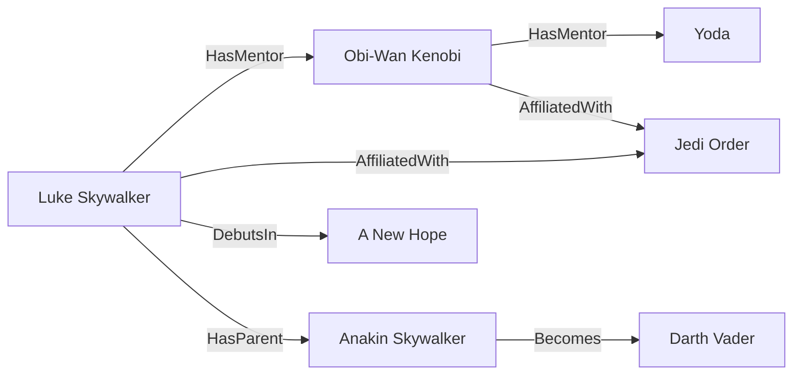

# Quick Start

## Install

```bash
brew install protobuf
cargo install nanograph-cli
```

## The Star Wars graph

The `examples/starwars/` directory has a ready-to-run knowledge graph — 9 node types, 25 edge types, 66 nodes, 146 edges.

Here's a slice of the graph:



The schema defines node types with typed properties, and edges between them:

```gq
node Character {
    slug: String @key
    name: String
    species: String
    alignment: enum(hero, villain, neutral)
    era: enum(prequel, clone_wars, original)
    tags: [String]?
}

node Film {
    slug: String @key
    name: String
    episode: I32
    release_date: Date
}

edge DebutsIn: Character -> Film
edge HasMentor: Character -> Character
edge AffiliatedWith: Character -> Faction { role: String? }
```

`@key` marks the identity property — used for edge resolution and merge operations. Types are enforced at load time and query compile time.

## Init and load

```bash
nanograph init sw.nano --schema examples/starwars/starwars.pg
nanograph load sw.nano --data examples/starwars/starwars.jsonl --mode overwrite
```

`init` creates the database directory from the schema. `load` ingests JSONL data — nodes and edges are validated against the schema.

## Query

```bash
# all Jedi
nanograph run --db sw.nano --query examples/starwars/starwars.gq --name jedi

# who did Yoda train?
nanograph run --db sw.nano --query examples/starwars/starwars.gq --name students_of --param name="Yoda"

# faction member counts
nanograph run --db sw.nano --query examples/starwars/starwars.gq --name faction_sizes
```

Queries are typechecked against the schema — wrong property names, type mismatches, and invalid traversals are caught before execution:

```bash
nanograph check --db sw.nano --query examples/starwars/starwars.gq
```

## Next steps

- [Schema Language Reference](schema.md) — types, annotations, constraints
- [Query Language Reference](queries.md) — match, return, traversal, mutations
- [Search Guide](search.md) — text search, vector search, hybrid ranking
- [CLI Reference](cli-reference.md) — all commands and options
- [Star Wars Example](starwars-example.md) — worked walkthrough with output
- [Context Graph Example](context-graph-example.md) — CRM/RevOps case study
